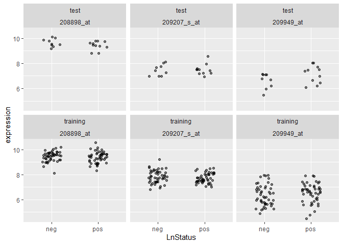
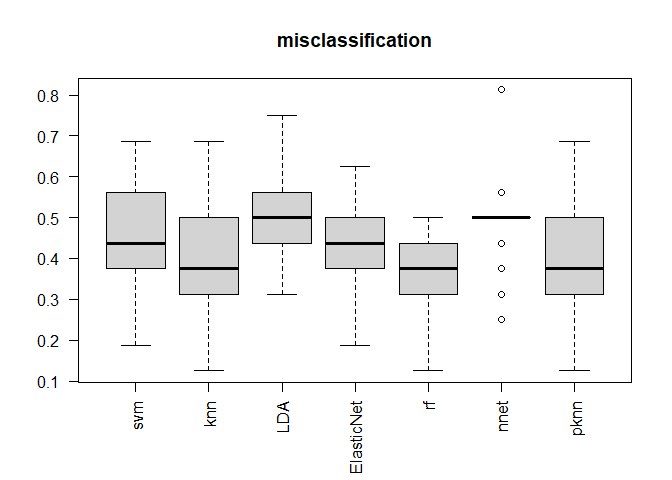
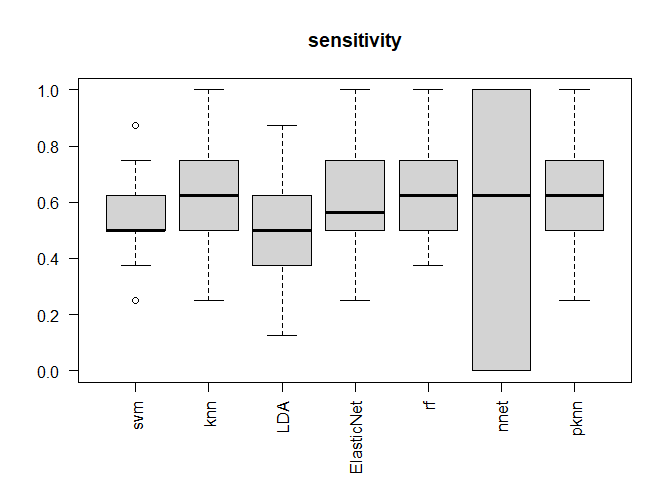
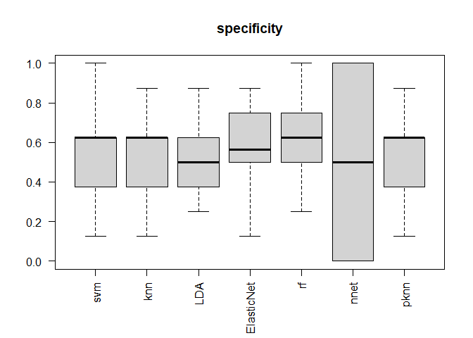
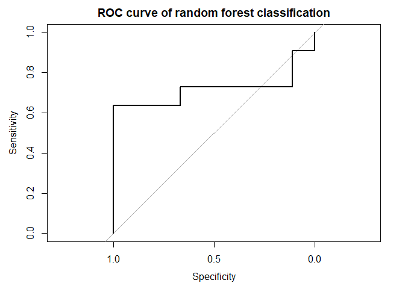

# Introduction

## What is gene expression?

Gene expression is the process by which information from a gene is used to synthesize functional gene products, such as proteins or RNA molecules. It involves the transcription of the gene's DNA into RNA and the translation of that RNA into a protein. The expression of a gene is the amount of its mRNA molecule that has been detected in a gene. The higher the expression indicates the higher abundance of mRNA detected.

In this project, we analyze the data set that comes from a paper by [Smeets et al. 2010](http://www.ncbi.nlm.nih.gov/geo/query/acc.cgi?acc=GSE23177), who studied Affymetrix expression profiles from primary breast tumours. The authors were interested in whether tumors which had spread to lymph nodes (LN positive, generally a bad sign) have different gene expression profiles than LN negative tumors. If so, how can a gene expression signature be used to predict tumor class?

Their data set contains 24236 genes on 116 samples. The status of the lymph node is known for each sample, with 59 LN positive and 57 LN negative. Samples were divided into two parts: 96 samples (48 LN positive and 48 LN negative) were used as a "training" set and 20 samples (11 LN positive and 9 LN negative) were used as a "test" set. There is also a quantitative measure, "LnRatio", the fraction of affected lymph nodes, presumably reflecting "how bad" the LnStatus is.

## Data Preparation

Install the following packages from Bioconductor: `CMA` and `GEOquery`. `CMA` is the package for classification methods using gene expression data, and `GEOquery` is the used to query biological data from the [NCBI website](https://www.ncbi.nlm.nih.gov/). We also install the following packages from CRAN: `ROCR`, `car`, `e1071` (for SVM), and `glmnet(Generalized linear model)` along with their dependencies.


```r
library(tidyverse)#Data wrangling and visualization
library(limma) 
library(ROCR)
library(CMA)
library(class) 
library(pROC)
```

```
## Warning: package 'pROC' was built under R version 4.3.3
```

```r
library(GEOquery) #Query the data 
```

First, let's retrieve our data set from GEO with `getGEO` from `GEOquery` package. The detail of the study is published on the [website](comes%20from%20a%20paper%20by%20Smeets%20et%20al.%202010).


```r
# Returns a list of expressionsets
datgeo <- getGEO('GSE23177', GSEMatrix = TRUE, AnnotGPL = TRUE) 
dat <- datgeo[[1]]   #Note that dat is an ExpressionSet
```


```r
dat
```

```
## ExpressionSet (storageMode: lockedEnvironment)
## assayData: 24236 features, 116 samples 
##   element names: exprs 
## protocolData: none
## phenoData
##   sampleNames: GSM570498 GSM570499 ... GSM570613 (116 total)
##   varLabels: title geo_accession ... patient type:ch1 (49 total)
##   varMetadata: labelDescription
## featureData
##   featureNames: 1007_s_at 1053_at ... 91952_at (24236 total)
##   fvarLabels: ID Gene title ... GO:Component ID (21 total)
##   fvarMetadata: Column Description labelDescription
## experimentData: use 'experimentData(object)'
##   pubMedIds: 21116709 
## Annotation: GPL570
```

The expression matrix contains the sample IDs and their corresponding gene expression profiles, which we can access from the `ExpressionSet` object with `exprs()`. Essentially, each column is a different sample(a tissue, under treatment, environment, etc) and each row is a gene(or a probe).


```r
#Print out the small subset of the expression matrix
exprs(dat)[1:10, 1:5]
```

```
##              GSM570498 GSM570499 GSM570500 GSM570501 GSM570502
## 1007_s_at     9.972979 10.905187 10.277672  9.675721 10.136213
## 1053_at       7.817832  7.079229  6.930580  7.250610  7.701002
## 117_at        8.725469  6.036008  5.481603  6.704801  6.704787
## 121_at        7.368854  6.575936  6.917470  6.533265  6.443367
## 1294_at       6.554170  6.764196  6.891401  6.609946  7.276797
## 1316_at       3.943299  4.889293  3.614283  4.496297  4.499382
## 1405_i_at     6.607460  6.640302  6.794514  6.507395  6.969491
## 1431_at       4.274017  3.932747  2.324288  2.355886  3.722960
## 1438_at       5.961952  5.699793  7.506902  6.775789  6.198671
## 1552256_a_at  8.228385  8.268530  8.039264  7.977523  8.480362
```

The properties associated with each sample are stored in the sample metadata, which can be accessed using the `pData()` function. For instance, the following code returns whether each sample is LN positive or LN negative, test or training group.


```r
# extract only those variables of interest 
pData(dat) <- pData(dat) %>%
  rename(sample_id = geo_accession,
         LnStatus = characteristics_ch1.2, #disease status
         LnRatio = characteristics_ch1.3, #the proportion of the infected node
         Set = characteristics_ch1) %>% #Which are training and testing set 
  mutate(LnStatus = factor(gsub("ln: ", "", LnStatus))) %>%
  mutate(LnRatio = as.numeric(gsub("lnratio: ", "", LnRatio))) %>%
  mutate(Set = ifelse(Set == "patient type: training set", "training", "test"))

str(pData(dat) %>% select(sample_id, LnStatus, LnRatio, Set) )
```

```
## 'data.frame':	116 obs. of  4 variables:
##  $ sample_id: chr  "GSM570498" "GSM570499" "GSM570500" "GSM570501" ...
##  $ LnStatus : Factor w/ 2 levels "neg","pos": 1 1 1 1 1 1 1 1 1 2 ...
##  $ LnRatio  : num  0 0 0 0 0 0 0 0 0 0.5 ...
##  $ Set      : chr  "test" "test" "test" "test" ...
```

Next, let's split the `ExpressionSet` object into two different parts - one for the training and one for the test set.


```r
# split the ExpressionSet into training and test sets. 
table(pData(dat)$Set)
```

```
## 
##     test training 
##       20       96
```

```r
train.es <- dat[, dat$Set == "training"]
test.es <- dat[ , dat$Set == "test"]
```

```r
#Look at the number of case/control
table(train.es$LnStatus)
```

```
## 
## neg pos 
##  48  48
```

```r
table(test.es$LnStatus)
```

```
## 
## neg pos 
##   9  11
```

Now, we can do some exploratory analysis of the data before trying some classification methods.


```r
# look at the expression of 3 randomly picked genes in both training and test sets
set.seed(1234)
rangenes <- sample(1:nrow(dat), size = 3) 

# function to create tidy data table of expression and metadata
toLonger <- function(expset) {
    stopifnot(class(expset) == "ExpressionSet")
    
    expressionMatrix <- longExpressionMatrix <- exprs(expset) %>% 
      as.data.frame() %>%
      rownames_to_column("gene") %>%
      pivot_longer(cols = !gene, 
                   values_to = "expression",
                   names_to = "sample_id") %>%
      left_join(pData(expset), by = "sample_id")
  return(expressionMatrix)
}

toLonger(dat[rangenes,]) %>%
  ggplot(aes(y = expression, x = LnStatus)) +
    facet_wrap(Set ~ gene) +
    geom_jitter(width = 0.2, alpha = 0.5)
```

<!-- -->

From the plot, it does not appear that one of these genes is deferentially expressed across negative and positive `LnStatus`. However, it is necessary to perform formal statistical test

# Differential expression(DE) analysis

The aim of DE analysis is to detect genes that are expressed with significant differences across different conditions. One of the commonly used approaches for this task is to employ linear regression, which assesses one gene at a time to obtain its p-value. After that, the genes that pass the significant threshold are selected. However, since the number of genes can be in tens of thousands, it is essential to control for the false positives. A common way to achieve this is by using the Bonferroni correction to the p-value.

However, there is a problem with this approach - the gene expression data is usually high dimensional, which means the number of measurements is large compared to the sample size. Basically, this problem can lead to an inflate in t-statistics and many false positives. The `Limma` package specially solves this problem by adjusting the t-statistics


```r
designMatrix <- model.matrix(~LnStatus, data = pData(dat))
LMmodel <- limma::lmFit(exprs(dat), designMatrix)
LMmodelEb <- eBayes(LMmodel)
```

The top $10$ most statistically significant genes are the following:


```r
topTable(LMmodelEb)
```

```
## Removing intercept from test coefficients
```

```
##                  logFC   AveExpr         t      P.Value adj.P.Val           B
## 208661_s_at -0.3847793 10.108683 -4.521262 1.468706e-05 0.3491816  1.43471257
## 205655_at   -0.6218631  5.261478 -4.247089 4.335858e-05 0.3491816  0.71985083
## 237746_at   -0.4480833  5.573586 -4.187085 5.463036e-05 0.3491816  0.56725204
## 229656_s_at  0.7837965  3.879888  4.155741 6.158687e-05 0.3491816  0.48810979
## 208663_s_at -0.4104289  9.257540 -4.114516 7.203779e-05 0.3491816  0.38462423
## 215307_at   -0.5994124  5.461940 -4.003212 1.094231e-04 0.3824809  0.10871177
## 228510_at   -0.3725724  4.974494 -4.000652 1.104706e-04 0.3824809  0.10242490
## 212384_at   -0.5195046  6.266492 -3.919799 1.489320e-04 0.4511896 -0.09464556
## 224872_at    0.2979676  8.331945  3.840721 1.986824e-04 0.5350297 -0.28466249
## 1556088_at  -0.3883365  4.984796 -3.791056 2.376244e-04 0.5679087 -0.40259597
```

# Fitting the Classification model

In the study, the researchers utilized a support vector machine classifier to differentiate between LN-positive and LN-negative tumors through classification. They assessed the outcomes using ROC curves. Following some optimization efforts, they achieved an area under the ROC curve (AUC) of 0.66 on the training data set and 0.65 on the test set. While these results surpass random chance, they do not provide strong evidence regarding the significance of the derived molecular signature. (Random chance would yield an AUC of 0.5, while perfect classification would result in an AUC of 1.0).

In this section, we want to compare multiple classification models' performance on this particular data set. We first employ cross-validation to identify the optimal model for predicting in the training set. We then select the best model to predict the `LnStatus` in the test set and evaluate its performance.

## Model selection


```r
#First Split the training set to perform cross-validation. By setting the argument strat = True, we ensure that each fold contains the same number of case and control samples. We also perform the cross-validation for 100 times by seting niter = 10.  
set.seed(123)
splits <- CMA::GenerateLearningsets(y = train.es$LnStatus, method="CV", fold=6, strat= TRUE, niter = 10)
```

Before testing the models, we first rank the genes by their significant level in association with `Lnstatus`. We only use the top features for the task of prediction. The function `Geneselection` does this for each fold.


```r
#Rank the genes in term of p-value using the Limma method
Topgenes <- CMA::GeneSelection(X=t(exprs(train.es)), y=train.es$LnStatus, learningsets=splits, method="limma")
```

In this example, I will compare the following classification methods:

-   K-Nearest-Neighborhood(KNN).

-   Linear Discrimination Analysis(LDA).

-   Support Vector Machine(SVM)

-   Elastic net.

-   Random Forest.

-   Feed-Forward Neural Networks.

-   Probabilistic nearest neighbour.


```r
set.seed(123)
n <- 50 #Number of top genes 
# Fitting the SVM model 
pr_SVM <- classification(X = t(exprs(train.es)), y = train.es$LnStatus, learningsets = splits,
genesel = Topgenes, nbgene = n, classifier = svmCMA, probability = TRUE)

#KNN
pr_KNN <- classification(X = t(exprs(train.es)), y = train.es$LnStatus, learningsets = splits,
genesel = Topgenes, nbgene = n, classifier = knnCMA)

# LDA
pr_LDA <- classification(X = t(exprs(train.es)), y = train.es$LnStatus, learningsets = splits,
genesel = Topgenes, nbgene = n, classifier = ldaCMA)

# Elastic Net
pr_EN <- classification(X = t(exprs(train.es)), y = train.es$LnStatus, learningsets = splits,
genesel = Topgenes, nbgene = n, classifier = ElasticNetCMA)

#Random forest
pr_RF <- classification(X = t(exprs(train.es)), y = train.es$LnStatus, learningsets = splits,
genesel = Topgenes, nbgene = n, classifier = rfCMA)
```

```
## Warning: package 'randomForest' was built under R version 4.3.3
```

```r
#Feed-Forward Neural Networks
pr_FNN <- classification(X = t(exprs(train.es)), y = train.es$LnStatus, learningsets = splits,
genesel = Topgenes, nbgene = n, classifier = nnetCMA)

#Probabilistic nearest neighbours
pr_PNN <- classification(X = t(exprs(train.es)), y = train.es$LnStatus, learningsets = splits,
genesel = Topgenes, nbgene = n, classifier = pknnCMA)
```

Let us make a comparison using multiple metrics:

-   Misclassification: The proportion of data that are labelled incorrectly.

-   Sensitivity: the proportion of actual positives which are correctly identified.

-   Specificity: the proportion of actual negatives which are correctly identified.

-   AUC: The area under the ROC(Receiver Operating Characteristic) curve. A ROC curve plots the true positive rate (sensitivity) against the false positive rate (1 - specificity) at different decision thresholds. An AUC value closer to 1 indicates a better model performance.

In medical contexts, there are situations where it is crucial to prioritize either high sensitivity or high specificity when selecting a model. For instance, in cancer diagnostics, achieving high sensitivity is paramount because misdiagnosing individuals with cancer can miss the opportunity for timely treatment.

Let us now compare the model's performance using these metrics.


```r
pr <- list(pr_SVM, pr_KNN, pr_LDA, pr_EN, pr_RF, pr_FNN, pr_PNN)
comparison <- compare(pr, plot = TRUE, measure = c("misclassification", "sensitivity", "specificity"))
```

<!-- --><!-- --><!-- -->

```r
print(comparison)
```

```
##            misclassification sensitivity specificity
## svm                0.4364583   0.5604167   0.5666667
## knn                0.4125000   0.6250000   0.5500000
## LDA                0.4947917   0.5083333   0.5020833
## ElasticNet         0.4187500   0.5812500   0.5812500
## rf                 0.3677083   0.6562500   0.6083333
## nnet               0.4895833   0.5312500   0.4895833
## pknn               0.4125000   0.6250000   0.5500000
```

We see that random forest achieves the lowest mis-classification rate. It also has the highest sensitivity and specificity among all models as well.


```r
#Compare the auc metric
pr2 <- list(pr_LDA, pr_EN, pr_RF, pr_FNN, pr_PNN, pr_SVM)
comparison2 <- compare(pr2, measure = c("auc"))
print(comparison2)
```

```
##                  auc
## LDA        0.5239583
## ElasticNet 0.5986979
## rf         0.6544271
## nnet       0.5020833
## pknn       0.4455729
## svm        0.5812500
```

It looks like that random forest method has the highest AUC. Based on all metrics, we conclude that random forest is the best classification model for this data set. Note this AUC is the same as what the authors achieved in their training set. Let us now evaluate it on the test set and see if there is any improvement.

## Testing the selected model

Now that we decided on which method we are going to use to classify samples in the test set, we need to train the model using the full training set and then classify samples of the test set.


```r
#Selecting the top 50 significant genes selected by the package Limma
inx <- rownames(topTable(LMmodelEb, number = 50))
train_exprsmat <- exprs(train.es)[inx,]
test_exprsmat <- exprs(test.es)[inx,]
```


```r
#Fitting the model
set.seed(344)
RF <- randomForest(x = t(train_exprsmat), y = train.es$LnStatus, xtest = t(test_exprsmat), ytest = test.es$LnStatus)

#Store the prediction value
yhat.RF <- RF$test$predicted

#Calculate the misclassification rate
pr.errTest<- mean(test.es$LnStatus != yhat.RF)
pr.errTest
```

```
## [1] 0.35
```

This is comparable to the misclassification rate obtained by the cross-validation(0.368).


```r
#Calculate the sensitivity and Specificity
sensitivity <- sum(yhat.RF[test.es$LnStatus == "pos"] == "pos")/ sum(test.es$LnStatus == "pos") 
specificity <- sum(yhat.RF[test.es$LnStatus == "neg"] == "neg")/ sum(test.es$LnStatus == "neg")
print(sensitivity); print(specificity)
```

```
## [1] 0.7272727
```

```
## [1] 0.5555556
```


```r
#Plot the ROC curve and compute the AUC
roc_obj <- roc(test.es$LnStatus,  RF$test$votes[,2] )
plot(roc_obj,main = "ROC curve of random forest classification")
```

<!-- -->

```r
auc(roc_obj)
```

```
## Area under the curve: 0.7172
```

The ROC plot illustrates that most data points are positioned above the diagonal line, which indicates a higher proportion of true positives compared to false positives. The Area Under the Curve (AUC) metric quantifies the overall performance of the model by calculating the area under the ROC curve. The AUC value is calculated to be 0.717, which is higher than what was achieved during cross-validation and what the authors achieved in their publication.

# Conclusion

We initiated our analysis by conducting inference on the data set to identify genes significantly associated with disease status. Subsequently, we utilized these genes to predict the disease status of test samples by leveraging the top 50 gene expressions. Our study involved the comparison of various machine learning methods through cross-validation, revealing that the random forest algorithm exhibited superior performance across all metrics (mis-classification rate of 0.368, sensitivity of 0.656, specificity of 0.608).

Further evaluation of the random forest model on the test set yielded an AUC value of 0.717, demonstrating a slight enhancement in performance compared to existing literature. However, in the context of cancer diagnostics, sensitivity emerges as a critical metric. With a sensitivity of 0.656, our model wrongly diagnoses an average of 34 out of 100 true cancer patients. This is not good enough to be of clinical relevance.

Considering the prevalence of lymph-node-positive breast cancer, which is approximately 33% during diagnosis (according to [<http://seer.cancer.gov/statfacts/html/breast.html>]), it is crucial to build a model with high sensitivity (close to 1). Given that both our best model and the authors' model achieve similar performance, it is likely that additional data, such as patient information, is essential to enhance prediction accuracy and clinical utility.
